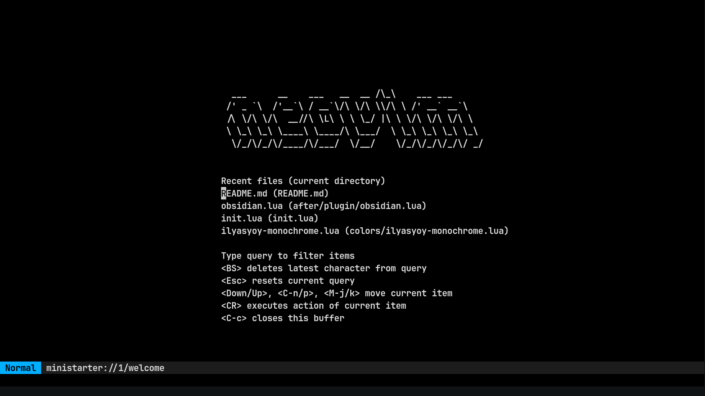

# nvim config ✍️ 

Ma editor, ma rules.  
Lua-based config built for TypeScript, Vue, Go, Python, and whatever else needs.

---



---

## what's inside

| | |
|---|---|
| Plugin manager | vim.pack |
| Completion | blink-cmp |
| LSP | mason.nvim + nvim-lspconfig |
| Fuzzy finder | snacks.picker |
| Syntax | treesitter |
| Git | lazygit + gitsigns |
| Notes | obsidian.nvim |
| Theme | IlyasYOY's monochrome |


---

## setup
```bash
mv ~/.config/nvim ~/.config/nvim.bak
git clone https://github.com/kovs713/nvim-config.git ~/.config/nvim
nvim
```

plugins auto-install via vim.pack on first launch.

### requirements
```
neovim 0.12.0+, git, node.js
```

optional: `ripgrep` (faster search), `fd` (better file finding), `imagemagick` (image previews)

---

## what it does

**navigation** — fuzzy files, quick switching, fast jumps, file browser, undo tree

**intelligence** — LSP with auto-installed servers, completion, diagnostics, treesitter highlighting

**editing** — auto-pairs, auto-tags, smart comments, inline git diffs, refactoring, markdown lists

**formatting** — auto-format on save: prettier, stylua, gofumpt, ruff. linting: eslint, golangci-lint

**ui** — clean dashboard, minimal statusline, notifications, transparent bg, pretty markdown

**extras** — obsidian notes, WakaTime, Discord RPC, image previews

---

## languages

TypeScript · JavaScript · Vue · React · Go · Python · Lua · HTML · CSS · Tailwind · GraphQL · Markdown

all get LSP, treesitter, and auto-formatting out of the box.

