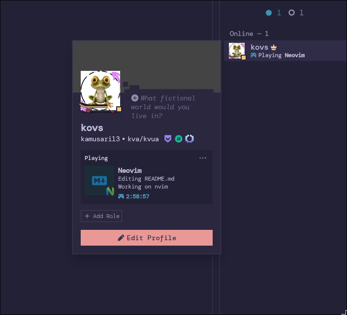

  

    
    
    
    
    
    
  

# Neovim Config

My personal Lua-based Neovim configuration. Focused on productivity, modern UI, and developer tools  (likely for TypeScript development).

## Installation

1. Backup your current Neovim config: `mv ~/.config/nvim ~/.config/nvim.bak`
2. Clone this repo: `git clone https://github.com/kamusari713/nvim-config.git ~/.config/nvim`
3. Launch Neovim: `nvim` (plugins will auto-install via lazy.nvim)

## Overview

This config uses [lazy.nvim](https://github.com/folke/lazy.nvim) for plugin management, with plugins organized into enabled/disabled folders and categorized for easy maintenance. It includes LSP support, Obsidian notes tooling, Treesitter syntax, Git integration, and more.

### Features
- **Modern UI**: Customizable dashboard, statusline, notifications, and markdown rendering.
- **Coding Tools**: LSP with diagnostics, code actions, refactoring, formatting, and linting.
- **Syntax & Completion**: Treesitter-based highlighting, auto-tagging, Tailwind/Emmet support, and fast completion.
- **Editing Enhancements**: Auto-pairs, comments, TODO highlighting, and indentation visualization.
- **Navigation**: Fuzzy finders, file explorers, quick jumps, and window management.
- **Git Integration**: Signs for changes, hunk staging, blame, and diffs.
- **Productivity**: Note-taking with Obsidian, time tracking, Discord presence, and image pasting.
- **Modular Mini.nvim**: Lightweight modules for surroundings, textobjects, icons, and more.
- **Customization**: Easily enable/disable plugins by moving files between folders.

### Requirements
- Neovim v0.11.4
- Git (for repo management).
- Node.js (for some LSP servers like TypeScript).
- Optional: ripgrep (for faster searching), fd (for file finding), ImageMagick (for image previews).

### Screenshots

Mini-starter

  

Snacks projects util

  

Lazygit integration

  

Gitsigns support
 

  

LSP support

  

Fzf and grep finder

  

Obsidian daily note taking

  

Markdown render support

  

Discord RPC support

  

## Keymaps

| Mode | Key | Action | Description |
|------|-----|--------|-------------|
| Ⓝ | <kbd>Space</kbd><kbd>s</kbd> | \<cmd>wall\<CR> | Save all buffers |
| Ⓝ | <kbd>Ctrl</kbd> + <kbd>a</kbd> | ggVG | Select all |
| Ⓝ | <kbd>Ctrl</kbd> + <kbd>d</kbd> | \<C-d>zz | - |
| Ⓝ | <kbd>Ctrl</kbd> + <kbd>u</kbd> | \<C-u>zz | - |
| Ⓥ | <kbd>J</kbd> | :m '>+1\<CR>gv=gv | Move line down in Visual mode |
| Ⓥ | <kbd>K</kbd> | :m '\<-2\<CR>gv=gv | Move line up in Visual mode |
| Ⓝ | <kbd>n</kbd> | nzz | - |
| Ⓝ | <kbd>N</kbd> | Nzz | - |
| Ⓝ | <kbd>*</kbd> | *zz | - |
| Ⓝ | <kbd>#</kbd> | #zz | - |
| Ⓝ | <kbd>g</kbd><kbd>*</kbd> | g*zz | - |
| Ⓝ | <kbd>g</kbd><kbd>#</kbd> | g#zz | - |
| Ⓥ | <kbd><</kbd> | <g | - |
| Ⓥ | <kbd>></kbd> | >g | - |
| Ⓥ | <kbd>p</kbd> | "_dP | Paste without saving |
| Ⓝ,Ⓞ | <kbd>H</kbd> | ^ | Go to start of line |
| Ⓝ,Ⓞ | <kbd>L</kbd> | g_ | Go to end of line |
| Ⓝ | <kbd>Ctrl</kbd> + <kbd>i</kbd> | \<C-o> | Replace goto next |
| Ⓝ | <kbd>Ctrl</kbd> + <kbd>o</kbd> | \<C-i> | Replace goto prev |
| Ⓝ | <kbd>Esc</kbd> | \<cmd>noh\<CR> | Clear search |

| Mode | Key | Action | Description |
|------|-----|--------|-------------|
| Ⓝ | <kbd>Space</kbd><kbd>r</kbd><kbd>f</kbd> | \<cmd>TSToolsRenameFile\<CR> | TS [R]ename [F]ile + Fix Imports |
| Ⓝ | <kbd>Space</kbd><kbd>i</kbd> | \<cmd>TSToolsOrganizeImports\<CR> | TS Tools Organize [I]mports |

| Mode | Key | Action | Description |
|------|-----|--------|-------------|
| Ⓝ | <kbd>Space</kbd><kbd>r</kbd><kbd>r</kbd> | require('refactoring').select_refactor { prefer_ex_cmd = true } | Refactor… |
| Ⓝ | <kbd>Space</kbd><kbd>r</kbd><kbd>e</kbd> | require('refactoring').refactor 'Extract Function' | Extract Function |
| Ⓝ | <kbd>Space</kbd><kbd>r</kbd><kbd>v</kbd> | require('refactoring').refactor 'Extract Variable' | Extract Variable |
| Ⓝ | <kbd>Space</kbd><kbd>r</kbd><kbd>I</kbd> | require('refactoring').refactor 'Inline Function' | Inline Function |
| Ⓝ | <kbd>Space</kbd><kbd>r</kbd><kbd>i</kbd> | require('refactoring').refactor 'Inline Variable' | Inline Variable |

| Mode | Key | Action | Description |
|------|-----|--------|-------------|
| Ⓝ | <kbd>]</kbd><kbd>h</kbd> | gitsigns.nav_hunk 'next' (or vim.cmd.normal in diff) | Jump to next git [c]hange |
| Ⓝ | <kbd>[</kbd><kbd>h</kbd> | gitsigns.nav_hunk 'prev' (or vim.cmd.normal in diff) | Jump to previous git [c]hange |
| Ⓥ | <kbd>Space</kbd><kbd>g</kbd><kbd>s</kbd> | gitsigns.stage_hunk { vim.fn.line '.', vim.fn.line 'v' } | [g]it [s]tage hunk |
| Ⓥ | <kbd>Space</kbd><kbd>g</kbd><kbd>r</kbd> | gitsigns.reset_hunk { vim.fn.line '.', vim.fn.line 'v' } | [g]it [r]eset hunk |
| Ⓝ | <kbd>Space</kbd><kbd>g</kbd><kbd>s</kbd> | gitsigns.stage_hunk | [g]it [s]tage hunk |
| Ⓝ | <kbd>Space</kbd><kbd>g</kbd><kbd>r</kbd> | gitsigns.reset_hunk | [g]it [r]eset hunk |
| Ⓝ | <kbd>Space</kbd><kbd>g</kbd><kbd>S</kbd> | gitsigns.stage_buffer | [g]it [S]tage buffer |
| Ⓝ | <kbd>Space</kbd><kbd>g</kbd><kbd>u</kbd> | gitsigns.stage_hunk | [g]it [u]ndo stage hunk |
| Ⓝ | <kbd>Space</kbd><kbd>g</kbd><kbd>R</kbd> | gitsigns.reset_buffer | [g]it [R]eset buffer |
| Ⓝ | <kbd>Space</kbd><kbd>g</kbd><kbd>p</kbd> | gitsigns.preview_hunk | [g]it [p]review hunk |
| Ⓝ | <kbd>Space</kbd><kbd>g</kbd><kbd>b</kbd> | gitsigns.blame_line | [g]it [b]lame line |
| Ⓝ | <kbd>Space</kbd><kbd>g</kbd><kbd>d</kbd> | gitsigns.diffthis | [g]it [d]iff against index |
| Ⓝ | <kbd>Space</kbd><kbd>g</kbd><kbd>D</kbd> | gitsigns.diffthis '@' | [g]it [D]iff against last commit |
| Ⓝ | <kbd>Space</kbd><kbd>t</kbd><kbd>b</kbd> | gitsigns.toggle_current_line_blame | [T]oggle git show [b]lame line |
| Ⓝ | <kbd>Space</kbd><kbd>t</kbd><kbd>D</kbd> | gitsigns.preview_hunk_inline | [T]oggle git show [D]eleted |

| Mode | Key | Action | Description |
|------|-----|--------|-------------|
| Ⓝ | <kbd>Space</kbd><kbd>f</kbd><kbd>t</kbd> | \<cmd>TodoFzfLua\<CR> | [F]zfLua [T]odo Comments |

| Mode | Key | Action | Description |
|------|-----|--------|-------------|
| - | <kbd>Space</kbd><kbd>?</kbd> | require('which-key').show { global = false } | Buffer Local Keymaps (which-key) |

| Mode | Key | Action | Description |
|------|-----|--------|-------------|
| Ⓝ | <kbd>Space</kbd><kbd>o</kbd><kbd>d</kbd> | \<cmd>Obsidian dailies\<cr> | [O]bsidian [D]ailies |
| Ⓝ | <kbd>Space</kbd><kbd>o</kbd><kbd>n</kbd><kbd>t</kbd> | \<cmd>Obsidian today\<cr> | [O]bsidian [N]ew [T]oday |
| Ⓝ | <kbd>Space</kbd><kbd>o</kbd><kbd>n</kbd><kbd>y</kbd> | \<cmd>Obsidian yesterday\<cr> | [O]bsidian [N]ew [Y]esterday |
| Ⓝ | <kbd>Space</kbd><kbd>o</kbd><kbd>n</kbd><kbd>n</kbd> | \<cmd>Obsidian new\<cr> | [O]bsidian [N]ew [N]ote |
| Ⓝ | <kbd>Space</kbd><kbd>o</kbd><kbd>s</kbd> | \<cmd>Obsidian search\<cr> | [O]bsidian [S]earch |
| Ⓝ | <kbd>g</kbt><kbd>f</kbd> | obsidian.util.gf_passthrough() | [G]oto markdown [F]ile |
| Ⓝ | <kbd>Enter</kbd> | obsidian.util.smart_action() | Obsidian smart action |
| Ⓝ | <kbd>Tab</kbd> | require('obsidian.api').nav_link 'next' | Go to next link |
| Ⓝ | <kbd>Shift</kbd> + <kbd>Tab</kbd> | require('obsidian.api').nav_link 'prev' | Go to previous link |

| Mode | Key | Action | Description |
|------|-----|--------|-------------|
| Ⓝ | <kbd>Space</kbd><kbd>l</kbd><kbd>h</kbd> | \<cmd>Lspsaga hover_doc\<CR> | [L]sp [H]over Doc |
| Ⓝ | <kbd>Space</kbd><kbd>l</kbd><kbd>R</kbd> | \<cmd>Lspsaga rename\<CR> | [L]sp [R]ename |
| Ⓝ | <kbd>Space</kbd><kbd>l</kbd><kbd>d</kbd> | \<cmd>Lspsaga peek_definition\<CR> | [L]sp Peek [D]efinition |
| Ⓝ | <kbd>Space</kbd><kbd>[</kbd><kbd>d</kbd> | \<cmd>Lspsaga diagnostic_jump_prev\<CR> | [D]iagnostic next |
| Ⓝ | <kbd>Space</kbd><kbd>]</kbd><kbd>d</kbd> | \<cmd>Lspsaga diagnostic_jump_next\<CR> | [D]iagnostic prev |
| Ⓝ | <kbd>g</kbd><kbd>d</kbd> | \<cmd>Lspsaga goto_definition\<CR> | [G]oto [D]efinition |
| Ⓝ | <kbd>Space</kbd><kbd>l</kbd><kbd>r</kbd> | require('fzf-lua').lsp_references() | [L]sp Peek [R]eferences |
| Ⓝ | <kbd>Space</kbd><kbd>l</kbd><kbd>e</kbd> | lua vim.diagnostic.open_float() | [L]sp Diagnostic Float [E] |

| Mode | Key | Action | Description |
|------|-----|--------|-------------|
| Ⓝ | <kbd>Ctrl</kbd> + <kbd>W</kbd><kbd>m</kbd> | \<Cmd>WinShift\<CR> | Toggle WinShift mode |
| Ⓝ | <kbd>Ctrl</kbd> + <kbd>Alt</kbd> + <kbd>h</kbd> | \<cmd>WinShift left\<CR> | Move window left [h] |
| Ⓝ | <kbd>Ctrl</kbd> + <kbd>Alt</kbd> + <kbd>j</kbd> | \<cmd>WinShift down\<CR> | Move window down [j] |
| Ⓝ | <kbd>Ctrl</kbd> + <kbd>Alt</kbd> + <kbd>k</kbd> | \<cmd>WinShift up\<CR> | Move window up [k] |
| Ⓝ | <kbd>Ctrl</kbd> + <kbd>Alt</kbd> + <kbd>l</kbd> | \<cmd>WinShift right\<CR> | Move window right [l] |
| Ⓝ | <kbd>Alt</kbd> + <kbd>h</kbd> | \<C-w>h | Moving to the window left [h] |
| Ⓝ | <kbd>Alt</kbd> + <kbd>j</kbd> | \<C-w>j | Moving to the window down [j] |
| Ⓝ | <kbd>Alt</kbd> + <kbd>k</kbd> | \<C-w>k | Moving to the window up [k] |
| Ⓝ | <kbd>Alt</kbd> + <kbd>l</kbd> | \<C-w>l | Moving to the window right [l] |
| Ⓝ | <kbd>Alt</kbd> + <kbd>=</kbd> | \<C-w>+ | Resize window + (increase horizontal) |
| Ⓝ | <kbd>Alt</kbd> + <kbd>-</kbd> | \<C-w>- | Resize window - (decrease horizontal) |
| Ⓝ | <kbd>Alt</kbd> + <kbd>.</kbd> | \<C-w>\< | Resize window \< (increase vertical) |
| Ⓝ | <kbd>Alt</kbd> + <kbd>,</kbd> | \<C-w>> | Resize window > (decrease vertical) |

| Mode | Key | Action | Description |
|------|-----|--------|-------------|
| Ⓝ | <kbd>Space</kbd><kbd>a</kbd> | harpoon:list():add() | Harpoon [A]dd file |
| Ⓝ | <kbd>Space</kbd><kbd>E</kbd> | harpoon.ui:toggle_quick_menu(harpoon:list()) | Harpoon m[E]nu |
| Ⓝ | <kbd>Ctrl</kbd> + <kbd>h</kbd> | harpoon:list():select(1) | Harpoon select 1 |
| Ⓝ | <kbd>Ctrl</kbd> + <kbd>j</kbd> | harpoon:list():select(2) | Harpoon select 2 |
| Ⓝ | <kbd>Ctrl</kbd> + <kbd>k</kbd> | harpoon:list():select(3) | Harpoon select 3 |
| Ⓝ | <kbd>Ctrl</kbd> + <kbd>l</kbd> | harpoon:list():select(4) | Harpoon select 4 |
| Ⓝ | <kbd>Alt</kbd> + <kbd>i</kbd> | harpoon:list():prev() | Harpoon goto prev |
| Ⓝ | <kbd>Alt</kbd> + <kbd>o</kbd> | harpoon:list():next() | Harpoon goto next |

| Mode | Key | Action | Description |
|------|-----|--------|-------------|
| Ⓝ | <kbd>Space</kbd><kbd>e</kbd><kbd>f</kbd> | <cmd>Neotree toggle float<CR> | Open Neo-Tree [E]xplorer [F]loating |
| Ⓝ | <kbd>Space</kbd><kbd>e</kbd><kbd>r</kbd> | <cmd>Neotree toggle position=right<CR> | Open Neo-Tree [E]xplorer on the [R]ight |

| Mode | Key | Action | Description |
|------|-----|--------|-------------|
| Ⓝ,Ⓥ | <kbd>Space</kbd><kbd>c</kbd><kbd>a</kbd> | require('fzf-lua').lsp_code_actions() | [C]ode [A]ctions |
| Ⓝ,Ⓥ | <kbd>Space</kbd><kbd>l</kbd><kbd>l</kbd> | \<cmd>LspRestart\<CR> | [L][L]sp Restart |
| Ⓝ | <kbd>Space</kbd><kbd>l</kbd><kbd>i</kbd> | require('fzf-lua').lsp_implementations() | [L]sp [I]mplimentations |

| Mode | Key | Action | Description |
|------|-----|--------|-------------|
| Ⓝ,Ⓥ | <kbd>Space</kbd><kbd>w</kbd><kbd>e</kbd> | require('nvim-emmet').wrap_with_abbreviation | [W]rap [E]lement |

## Plugins by Category

Plugins are organized into categories under `plugins/enabled/`. Each category contains individual `.lua` files for plugin configs.

| Category | Plugin | Repo | Description |
|----------|--------|------|-------------|
| Appearance | colorizer | [NvChad/nvim-colorizer.lua](https://github.com/NvChad/nvim-colorizer.lua) | High-performance color highlighter for code. |
| Appearance | dressing | [stevearc/dressing.nvim](https://github.com/stevearc/dressing.nvim) | Improves default vim.ui interfaces like input and select. |
| Appearance | incline | [b0o/incline.nvim](https://github.com/b0o/incline.nvim) | Floating statuslines for windows (winbar alternative). |
| Appearance | mini-starter | [echasnovski/mini.nvim](https://github.com/echasnovski/mini.nvim) | Minimalistic start screen module. |
| Appearance | mini-statusline | [echasnovski/mini.nvim](https://github.com/echasnovski/mini.nvim) | Configurable, compact or fancy statusline. |
| Appearance | render-markdown | [MeanderingProgrammer/render-markdown.nvim](https://github.com/MeanderingProgrammer/render-markdown.nvim) | Improves viewing Markdown files in Neovim. |
| Appearance | rosepine | [rose-pine/neovim](https://github.com/rose-pine/neovim) | Soho vibes colorscheme for Neovim. |
| Cmp | blink-cmp | [Saghen/blink.cmp](https://github.com/Saghen/blink.cmp) | Performant, batteries-included completion plugin. |
| LSP | debug | [mfussenegger/nvim-dap](https://github.com/mfussenegger/nvim-dap) | Debug Adapter Protocol client implementation. |
| LSP | lazydev | [folke/lazydev.nvim](https://github.com/folke/lazydev.nvim) | Faster LuaLS setup for editing Neovim configs. |
| LSP | lspconfig | [neovim/nvim-lspconfig](https://github.com/neovim/nvim-lspconfig) | Quickstart configs for Nvim LSP. |
| LSP | lspsaga | [nvimdev/lspsaga.nvim](https://github.com/nvimdev/lspsaga.nvim) | Lightweight LSP plugin with performant UI. |
| LSP | mason | [mason-org/mason.nvim](https://github.com/mason-org/mason.nvim) | Portable package manager for installing LSP servers, linters, etc. |
| Formatting | conform | [stevearc/conform.nvim](https://github.com/stevearc/conform.nvim) | Lightweight yet powerful formatter plugin. |
| Formatting | lint | [mfussenegger/nvim-lint](https://github.com/mfussenegger/nvim-lint) | Asynchronous linter plugin. |
| Syntax | emmet | [olrtg/nvim-emmet](https://github.com/olrtg/nvim-emmet) | Emmet abbreviation and expansion for Neovim. |
| Syntax | nvim-treesitter | [nvim-treesitter/nvim-treesitter](https://github.com/nvim-treesitter/nvim-treesitter) | Treesitter configurations and abstraction layer. |
| Syntax | tailwind-tools | [luckasRanarison/tailwind-tools.nvim](https://github.com/luckasRanarison/tailwind-tools.nvim) | Unofficial Tailwind CSS integration and tooling. |
| Syntax | ts-autotag | [windwp/nvim-ts-autotag](https://github.com/windwp/nvim-ts-autotag) | Uses Treesitter to auto-close and rename tags. |
| Syntax | typescript-tools | [pmizio/typescript-tools.nvim](https://github.com/pmizio/typescript-tools.nvim) | TypeScript integration with LSP features. |
| Editing | autopairs | [windwp/nvim-autopairs](https://github.com/windwp/nvim-autopairs) | Autopairs written in Lua. |
| Editing | bullets | [bullets-vim/bullets.vim](https://github.com/bullets-vim/bullets.vim) | Automated bullet and numbered lists for Markdown. |
| Editing | comment | [numToStr/Comment.nvim](https://github.com/numToStr/Comment.nvim) | Smart and powerful commenting. |
| Editing | refactoring | [ThePrimeagen/refactoring.nvim](https://github.com/ThePrimeagen/refactoring.nvim) | Refactoring library based on Martin Fowler's book. |
| Editing | sleuth | [tpope/vim-sleuth](https://github.com/tpope/vim-sleuth) | Heuristically sets shiftwidth and expandtab. |
| Editing | todo-comments | [folke/todo-comments.nvim](https://github.com/folke/todo-comments.nvim) | Highlights and searches TODO comments. |
| Navigation | flash | [folke/flash.nvim](https://github.com/folke/flash.nvim) | Enhances search with labels for quick jumps. |
| Navigation | fzf | [ibhagwan/fzf-lua](https://github.com/ibhagwan/fzf-lua) | Improved fzf.vim written in Lua. |
| Navigation | harpoon | [ThePrimeagen/harpoon](https://github.com/ThePrimeagen/harpoon) | Per-project marks for fast file navigation. |
| Navigation | neo-tree | [nvim-neo-tree/neo-tree.nvim](https://github.com/nvim-neo-tree/neo-tree.nvim) | File system and tree-like structure manager. |
| Navigation | snacks | [folke/snacks.nvim](https://github.com/folke/snacks.nvim) | Collection of lightweight Neovim plugins. |
| Navigation | trouble | [folke/trouble.nvim](https://github.com/folke/trouble.nvim) | Pretty diagnostics, references, and lists. |
| Navigation | which-key | [folke/which-key.nvim](https://github.com/folke/which-key.nvim) | Displays possible keybindings in popup. |
| Navigation | winshift | [sindrets/winshift.nvim](https://github.com/sindrets/winshift.nvim) | Rearranges windows with ease. |
| Git | gitsigns | [lewis6991/gitsigns.nvim](https://github.com/lewis6991/gitsigns.nvim) | Git integration with signs for changes. |
| Productivity | cord | [vyfor/cord.nvim](https://github.com/vyfor/cord.nvim) | Discord Rich Presence for Neovim. |
| Productivity | img-clip | [HakonHarnes/img-clip.nvim](https://github.com/HakonHarnes/img-clip.nvim) | Effortlessly embeds images into markup. |
| Productivity | obsidian | [epwalsh/obsidian.nvim](https://github.com/epwalsh/obsidian.nvim) | Obsidian vault integration for notes. |
| Productivity | wakatime | [wakatime/vim-wakatime](https://github.com/wakatime/vim-wakatime) | Automatic time tracking for coding. |
| Mini | mini-surround | [echasnovski/mini.nvim](https://github.com/echasnovski/mini.nvim) | Fast and feature-rich surround actions. |
| Mini | mini-ai | [echasnovski/mini.nvim](https://github.com/echasnovski/mini.nvim) | Extends and creates a/i textobjects. |
| Mini | mini-icons | [echasnovski/mini.nvim](https://github.com/echasnovski/mini.nvim) | Icon provider with caching and customization. |
| Mini | mini-pairs | [echasnovski/mini.nvim](https://github.com/echasnovski/mini.nvim) | Minimal and fast autopair module. |
| Mini | mini-indentscope | [echasnovski/mini.nvim](https://github.com/echasnovski/mini.nvim) | Visualizes and operates on indent scopes. |
| Mini | mini-cursorword | [echasnovski/mini.nvim](https://github.com/echasnovski/mini.nvim) | Auto-highlights word under cursor. |

## Contributing
Feel free to fork and submit pull requests for improvements, bug fixes, or new features.

## License
MIT License - see [LICENSE](LICENSE.md) for details.
