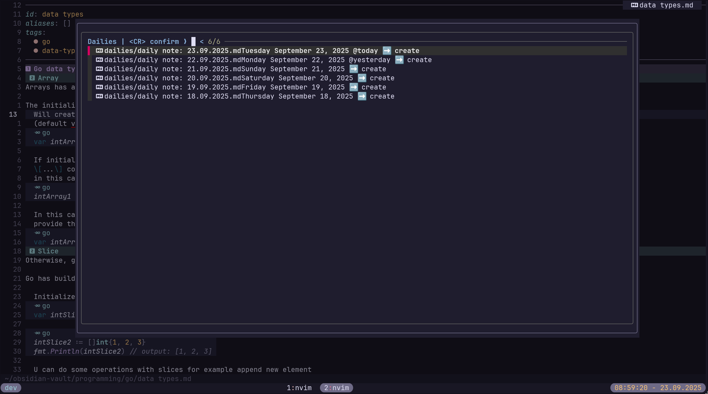
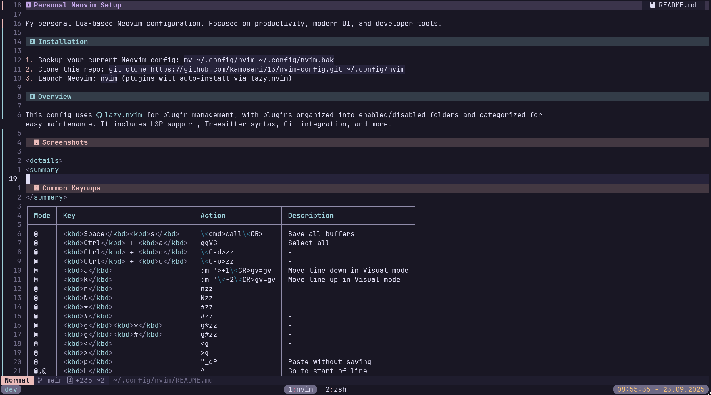

  

    
    
    
    
    
    
  

# Neovim Config

Personal Lua-based Neovim configuration for modern development with TypeScript, Go, Python, and more.

## Installation

1. Backup your current config: `mv ~/.config/nvim ~/.config/nvim.bak`
2. Clone this repo: `git clone https://github.com/kovs713/nvim-config.git ~/.config/nvim`
3. Launch Neovim: `nvim` (plugins auto-install via lazy.nvim)

## Overview

This config is built around [lazy.nvim](https://github.com/folke/lazy.nvim) for plugin management.

### What Config Provide

**Navigation** — Fuzzy file finding, quick file switching, fast code jumping, file browser, undo tree

**Code Intelligence** — LSP support with auto-installed language servers, autocompletion, go-to-definition, diagnostics, syntax highlighting with treesitter

**Editing** — Auto-pairs, auto-tags, smart commenting, inline git diffs, refactoring tools, markdown bullet lists

**Formatting & Linting** — Auto-format on save with prettier, stylua, gofumpt, ruff. Linting with eslint and golangci-lint

**UI** — Clean starter dashboard, minimal statusline, notifications, transparent backgrounds, pretty markdown rendering

**Extras** — Obsidian notes integration, AI coding assistance, WakaTime tracking, Discord Rich Presence, image previews

### Language Support

TypeScript, JavaScript, Vue, React, Svelte, Go, Python, Lua, HTML, CSS, Tailwind, GraphQL, JSON, YAML, Markdown

All get LSP support, syntax highlighting, and auto-formatting out of the box.

### Requirements

Neovim 0.11.5+, Git, Node.js

Optional: ripgrep (faster search), fd (better file finding), ImageMagick (image previews)

## Screenshots

Mini-starter

  

Snacks projects util

  

Lazygit integration

  

Gitsigns support
 

  

LSP support

  

Fzf and grep finder

  

Obsidian daily note taking

  

Markdown render support

  

Discord RPC support

  

## License

MIT License - see [LICENSE](LICENSE.md) for details.
